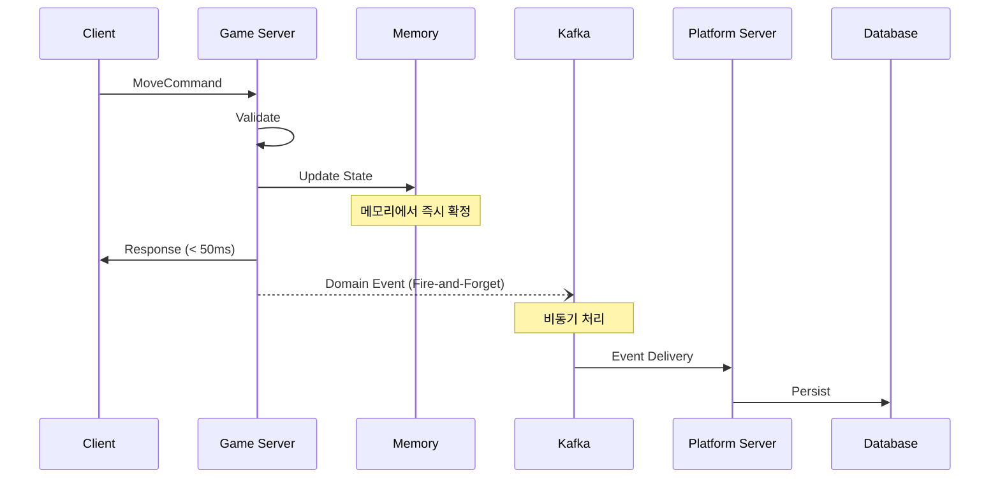
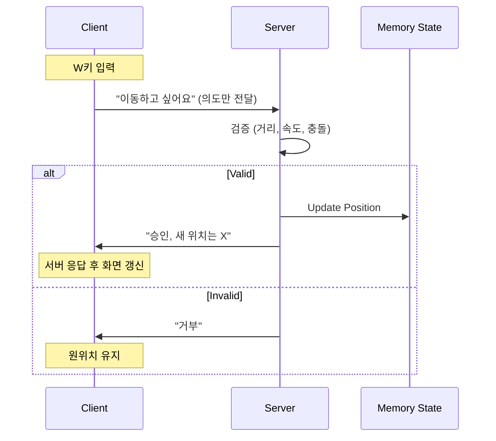
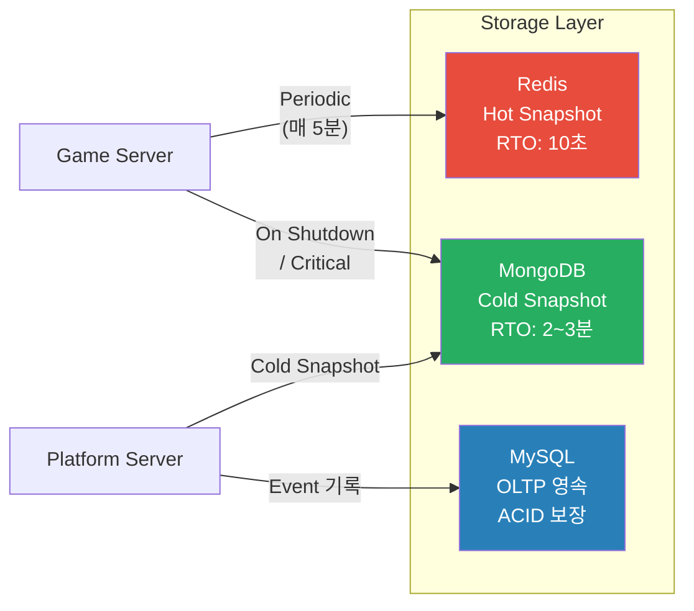
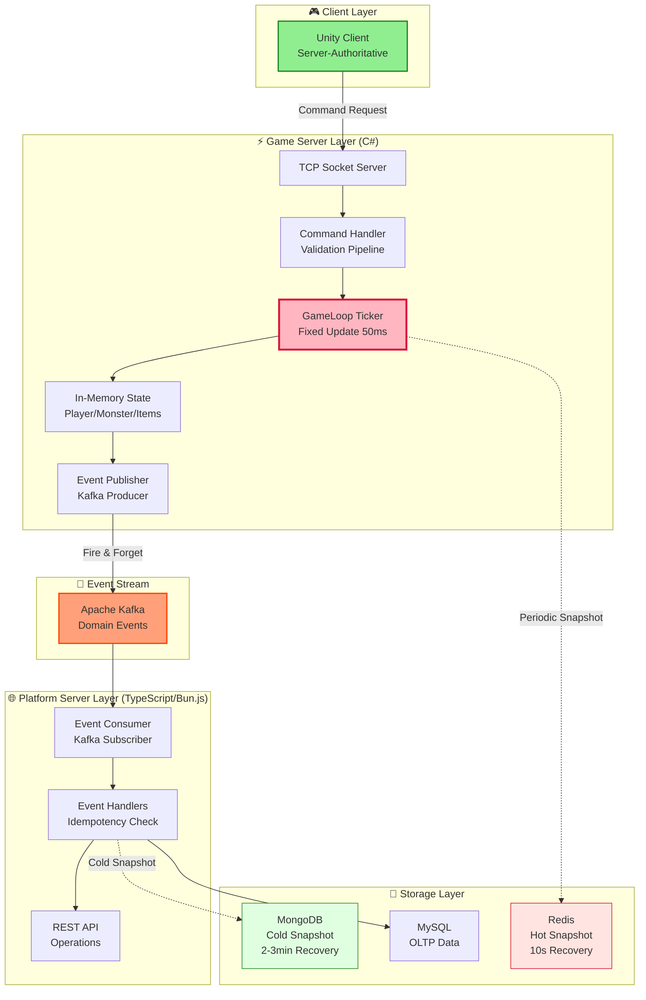
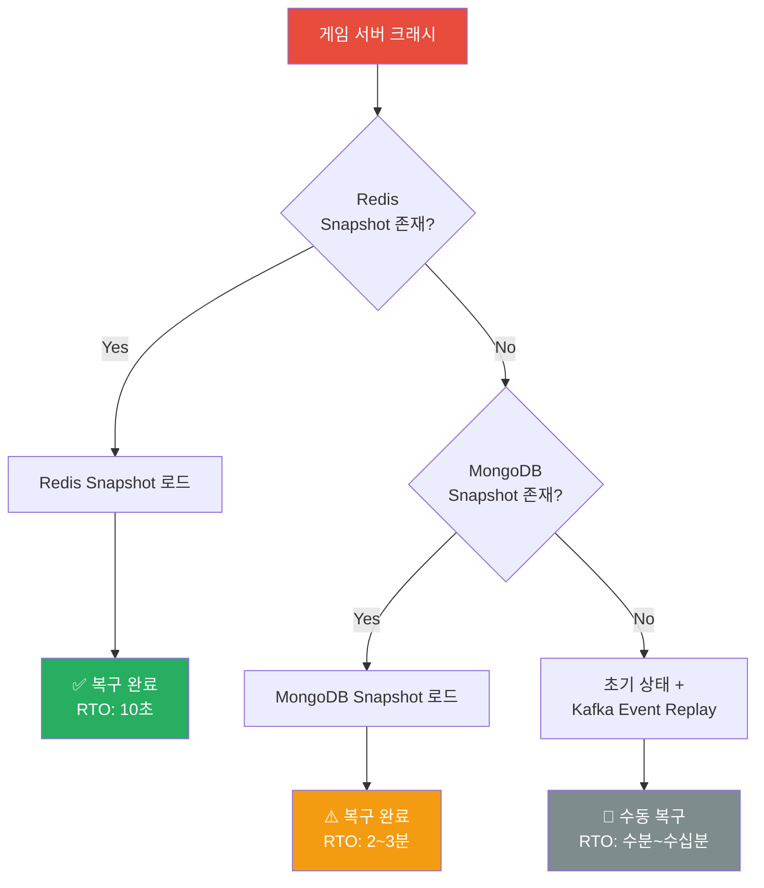
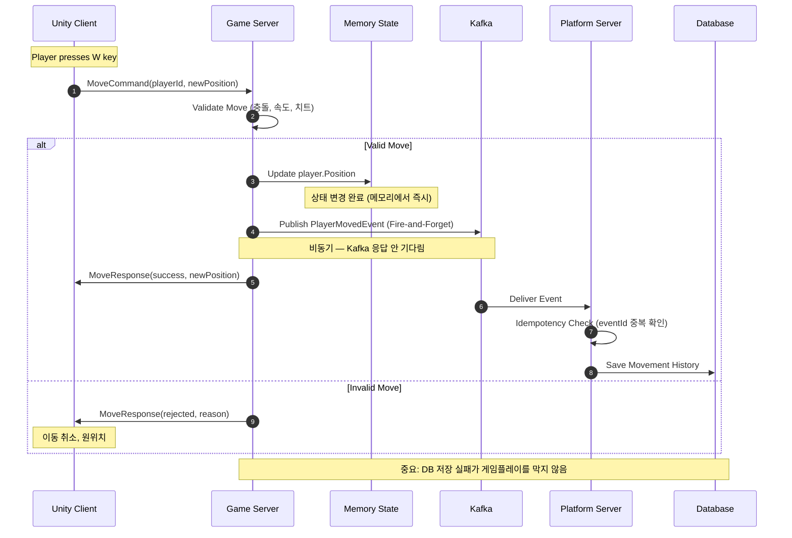
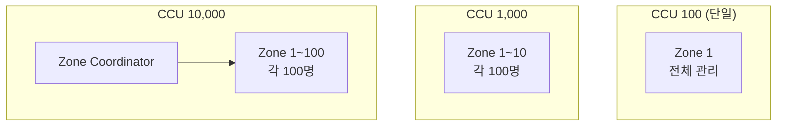
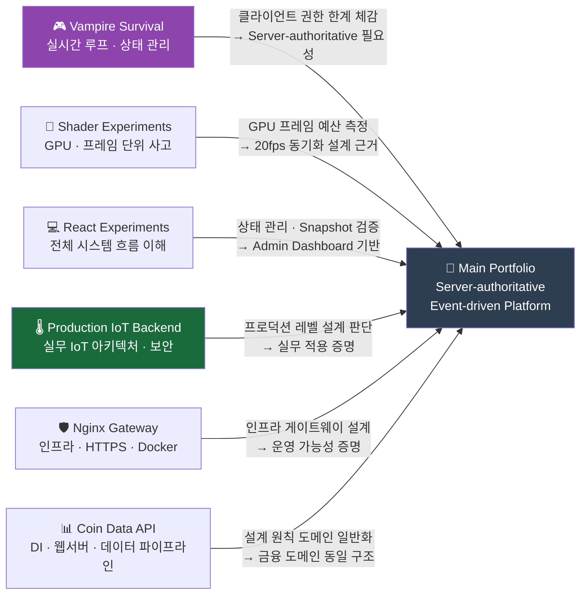

# Event-driven Real-time Game Platform Architecture

> **실시간 판정은 메모리에서 끝나고, 기록과 복구는 비동기로 흡수되는 구조**

[](docs/architecture-detail.md)
[](docs/implementation-roadmap.md)
[](LICENSE)

---

## 📋 목차

1. [Executive Summary](#-executive-summary)
2. [3가지 핵심 설계 결정](#-3가지-핵심-설계-결정)
3. [의도적으로 하지 않은 것들](#-의도적으로-하지-않은-것들)
4. [시스템 아키텍처](#-시스템-아키텍처)
5. [장애 대응 설계](#️-장애-대응-설계)
6. [핵심 흐름: Command → Event](#-핵심-흐름-command--event)
7. [확장 시나리오](#-확장-시나리오)
8. [기술 스택](#️-기술-스택)
9. [상세 문서](#-상세-문서)
10. [구현 로드맵](#️-구현-로드맵)
11. [Supporting Portfolios](#-supporting-portfolios)
12. [한 줄 요약](#-한-줄-요약)

---

## 📌 Executive Summary

**이 포트폴리오가 증명하는 것:**

```
✓ 실시간 시스템에서의 책임 분리 설계 능력
✓ Server-authoritative 구조에 대한 깊은 이해
✓ 이벤트 기반 아키텍처의 실무적 적용
✓ 장애, 복구, 운영까지 고려한 시스템 설계
✓ 개인이 아닌 조직에 남는 시스템을 만드는 관점
```

**대상 독자**: CTO, 테크 리드, 시니어 백엔드/서버 엔지니어

> "코드를 작성하는 능력이 아니라, 시스템을 설계하고 판단하는 능력을 보여줍니다."

---

## 🏗️ 3가지 핵심 설계 결정

### 1️⃣ 실시간 판정과 기록의 완전한 분리


```mermaid
sequenceDiagram
    participant C as Client
    participant GS as Game Server
    participant M as Memory
    participant K as Kafka
    participant PS as Platform Server
    participant DB as Database

    C->>GS: MoveCommand
    GS->>GS: Validate
    GS->>M: Update State
    Note over M: 메모리에서 즉시 확정
    GS->>C: Response (< 50ms)
    GS--)K: Domain Event (Fire-and-Forget)
    Note over K: 비동기 처리
    K->>PS: Event Delivery
    PS->>DB: Persist
```

**실무 시나리오:**

```
Kafka 다운 발생:
❌ 잘못된 설계: 게임 서버도 멈춤
✅ 이 설계: 게임은 계속, 이벤트는 메모리 버퍼링 → 복구 후 재전송
```

---

### 2️⃣ Server-authoritative 구조


```mermaid
sequenceDiagram
    participant C as Client
    participant S as Server
    participant M as Memory State

    Note over C: W키 입력
    C->>S: "이동하고 싶어요" (의도만 전달)
    S->>S: 검증 (거리, 속도, 충돌)
    alt Valid
        S->>M: Update Position
        S->>C: "승인, 새 위치는 X"
        Note over C: 서버 응답 후 화면 갱신
    else Invalid
        S->>C: "거부"
        Note over C: 원위치 유지
    end
```

**결론**: 복잡해서가 아니라 안정성을 위해 선택.  
클라이언트에 권한을 주는 순간 메모리 해킹, 동기화 불일치, 신뢰성 상실이 구조적으로 발생합니다.

---

### 3️⃣ Polyglot Persistence — 저장소별 역할 분리


```mermaid
graph LR
    GS["Game Server"]

    subgraph Storage["Storage Layer"]
        REDIS["Redis\nHot Snapshot\nRTO: 10초"]
        MONGO["MongoDB\nCold Snapshot\nRTO: 2~3분"]
        MYSQL["MySQL\nOLTP 영속\nACID 보장"]
    end

    GS -->|"Periodic\n(매 5분)"| REDIS
    GS -->|"On Shutdown\n/ Critical"| MONGO
    PS["Platform Server"] -->|"Event 기록"| MYSQL
    PS -->|"Cold Snapshot"| MONGO

    style REDIS fill:#e74c3c,color:#fff
    style MONGO fill:#27ae60,color:#fff
    style MYSQL fill:#2980b9,color:#fff
```

| 저장소 | 역할 | 선택 이유 |
|--------|------|-----------|
| Redis | Hot Snapshot, 세션 | 속도 최우선, TTL 자동 관리 |
| MongoDB | Cold Snapshot, 이벤트 로그 | 유연한 스키마, 대용량 로그 |
| MySQL | 정형 데이터, 트랜잭션 | ACID, 복잡한 쿼리 |

---

## 🚫 의도적으로 하지 않은 것들

> **"지금 필요하지 않으면, 지금 만들지 않는다"**  
> 하지만 필요해질 때 교체 가능한 구조로 설계해 두었다.

| 비선택 | 선택하지 않은 이유 | 대신 선택한 것 |
|--------|-----------------|--------------|
| 게임 서버 직접 DB 접근 | GameLoop이 DB 응답을 기다리면 장애 전파 → 게임 멈춤 | Kafka 비동기 이벤트 |
| 모든 처리 동기화 | CCU 10,000명 시 응답 5,000ms → 게임 불가 | 판정 즉시 / 기록 비동기 분리 |
| 초기 MSA 구조 | Over-engineering, 운영 복잡도 과다, 분산 트랜잭션 부담 | Modular Monolith (필요 시 분리) |
| UDP 프로토콜 | 포트폴리오 목적은 아키텍처 증명, 구현 복잡도만 증가 | TCP (MOBA·퍼즐 수준에 충분) |
| NoSQL Only | 정형 데이터 처리 어려움, 트랜잭션 제약 | Polyglot Persistence |
| 완전한 MMO 콘텐츠 | "언제 멈추어야 하는지 아는 것"이 핵심 | MVP + 구조 증명 |

---

## 📊 시스템 아키텍처

### 전체 구성도


```mermaid
graph TB
    subgraph Client["🎮 Client Layer"]
        UNITY["Unity Client\nServer-Authoritative"]
    end

    subgraph GameServer["⚡ Game Server Layer (C#)"]
        TCP["TCP Socket Server"]
        GAMELOOP["GameLoop Ticker\nFixed Update 50ms"]
        MEMORY["In-Memory State\nPlayer/Monster/Items"]
        COMMAND["Command Handler\nValidation Pipeline"]
        EVENT_PUB["Event Publisher\nKafka Producer"]
    end

    subgraph EventStream["📨 Event Stream"]
        KAFKA["Apache Kafka\nDomain Events"]
    end

    subgraph PlatformServer["🌐 Platform Server Layer (TypeScript/Bun.js)"]
        EVENT_SUB["Event Consumer\nKafka Subscriber"]
        HANDLER["Event Handlers\nIdempotency Check"]
        REST["REST API\nOperations"]
    end

    subgraph StorageLayer["💾 Storage Layer"]
        REDIS["Redis\nHot Snapshot\n10s Recovery"]
        MONGO["MongoDB\nCold Snapshot\n2-3min Recovery"]
        MYSQL["MySQL\nOLTP Data"]
    end

    UNITY -->|"Command Request"| TCP
    TCP --> COMMAND
    COMMAND --> GAMELOOP
    GAMELOOP --> MEMORY
    MEMORY --> EVENT_PUB
    EVENT_PUB -->|"Fire & Forget"| KAFKA
    KAFKA --> EVENT_SUB
    EVENT_SUB --> HANDLER
    HANDLER --> REST
    GAMELOOP -.->|"Periodic Snapshot"| REDIS
    HANDLER -.->|"Cold Snapshot"| MONGO
    HANDLER --> MYSQL

    style UNITY fill:#90EE90,stroke:#228B22,stroke-width:2px
    style GAMELOOP fill:#FFB6C1,stroke:#DC143C,stroke-width:3px
    style KAFKA fill:#FFA07A,stroke:#FF4500,stroke-width:2px
    style REDIS fill:#FFE4E1,stroke:#DC143C
    style MONGO fill:#E0FFE0,stroke:#228B22
```

### Command vs Event

| 구분 | Command | Domain Event |
|------|---------|--------------|
| **의미** | "해달라" (요청) | "이미 일어났다" (사실) |
| **시점** | 미래 | 과거 |
| **실패** | 가능 | 불가능 (이미 발생) |
| **흐름** | Client → Server | Server → Platform |
| **용도** | 게임 로직 실행 | 기록 및 연동 |

---

## 🛡️ 장애 대응 설계

### 장애 영향도 매트릭스

| 장애 대상 | 게임플레이 | 기록 | 운영 API | RTO | 복구 방식 |
|-----------|------------|------|----------|-----|----------|
| 게임 서버 | 🔴 중단 | 🟡 일시 중단 | 🟢 정상 | 10초 | Redis Hot Snapshot |
| Redis | 🟡 순간 지연 | 🟢 정상 | 🟢 정상 | 수초 | Failover |
| MongoDB | 🟢 정상 | 🟢 정상 | 🟢 정상 | 낮음 | Replica |
| Kafka | 🟢 정상 | 🟡 일시 중단 | 🟢 정상 | 즉시 | 메모리 버퍼 |
| MySQL | 🟢 정상 | 🟡 일시 중단 | 🔴 일부 실패 | 중간 | Kafka 누적 후 재처리 |
| 플랫폼 서버 | 🟢 정상 | 🟡 일시 중단 | 🔴 중단 | 수초 | 재시작 + Offset 재개 |

> **설계 철학**: "게임플레이는 어떤 백엔드 장애에도 멈추지 않는다"

### 복구 우선순위


```mermaid
flowchart TD
    CRASH["게임 서버 크래시"] --> CHECK_REDIS{"Redis\nSnapshot 존재?"}
    CHECK_REDIS -->|"Yes"| LOAD_REDIS["Redis Snapshot 로드"]
    LOAD_REDIS --> DONE_FAST["✅ 복구 완료\nRTO: 10초"]
    CHECK_REDIS -->|"No"| CHECK_MONGO{"MongoDB\nSnapshot 존재?"}
    CHECK_MONGO -->|"Yes"| LOAD_MONGO["MongoDB Snapshot 로드"]
    LOAD_MONGO --> DONE_SLOW["⚠️ 복구 완료\nRTO: 2~3분"]
    CHECK_MONGO -->|"No"| REPLAY["초기 상태 +\nKafka Event Replay"]
    REPLAY --> DONE_MANUAL["🔧 수동 복구\nRTO: 수분~수십분"]

    style CRASH fill:#e74c3c,color:#fff
    style DONE_FAST fill:#27ae60,color:#fff
    style DONE_SLOW fill:#f39c12,color:#fff
    style DONE_MANUAL fill:#7f8c8d,color:#fff
```

---

## 🔄 핵심 흐름: Command → Event (플레이어 이동)


```mermaid
sequenceDiagram
    autonumber
    participant C as Unity Client
    participant GS as Game Server
    participant M as Memory State
    participant K as Kafka
    participant PS as Platform Server
    participant DB as Database

    Note over C: Player presses W key
    C->>GS: MoveCommand(playerId, newPosition)
    GS->>GS: Validate Move (충돌, 속도, 치트)

    alt Valid Move
        GS->>M: Update player.Position
        Note over M: 상태 변경 완료 (메모리에서 즉시)
        GS->>K: Publish PlayerMovedEvent (Fire-and-Forget)
        Note over GS,K: 비동기 — Kafka 응답 안 기다림
        GS->>C: MoveResponse(success, newPosition)
        K->>PS: Deliver Event
        PS->>PS: Idempotency Check (eventId 중복 확인)
        PS->>DB: Save Movement History
    else Invalid Move
        GS->>C: MoveResponse(rejected, reason)
        Note over C: 이동 취소, 원위치
    end

    Note over GS,DB: 중요: DB 저장 실패가 게임플레이를 막지 않음
```

**핵심 포인트:**

1. 게임 서버는 Kafka 응답을 기다리지 않음
2. 상태는 메모리에서 이미 확정됨
3. 기록 실패가 게임플레이를 막지 않음

---

## 📈 확장 시나리오

### Zone 기반 수평 확장


```mermaid
graph TB
    subgraph Scale100["CCU 100 (단일)"]
        Z1["Zone 1\n전체 관리"]
    end

    subgraph Scale1000["CCU 1,000"]
        Z2["Zone 1~10\n각 100명"]
    end

    subgraph Scale10000["CCU 10,000"]
        ZC["Zone Coordinator"]
        ZN["Zone 1~100\n각 100명"]
        ZC --> ZN
    end
```

| CCU 규모 | 구조 | 변경 범위 |
|----------|------|----------|
| 100 | Zone 1 (단일) | 초기 구조 |
| 1,000 | Zone 1~10 (각 100명) | Zone 수만 증가 |
| 10,000 | Zone Coordinator → Zone 1~100 | Coordinator 레이어 추가 |

### B2B 비즈니스 모델 확장

게임 서버 코드 수정 없이 Kafka Topic을 구독하는 Tenant를 추가하면 확장됩니다.

```
Core Game Server → Kafka Topics → Tenant A (Custom Platform + DB)
                                → Tenant B (Custom Platform + DB)
                                → Tenant C (Custom Platform + DB)
```

---

## 🛠️ 기술 스택

| 영역 | 기술 |
|------|------|
| 게임 서버 | C# .NET 8.0, TCP/IP, MessagePack |
| 플랫폼 서버 | TypeScript, Bun.js, ElysiaJS, Drizzle ORM |
| 이벤트 스트림 | Apache Kafka |
| 저장소 | Redis (Hot Snapshot), MongoDB (Cold Snapshot), MySQL (영속) |
| 클라이언트 | Unity 2022.3 LTS |

---

## 📚 상세 문서

| 문서 | 설명 | 대상 독자 |
|------|------|-----------|
| [아키텍처 상세](docs/architecture-detail.md) | 전체 시스템 구조 및 설계 원칙 | 백엔드 엔지니어 |
| [설계 결정 과정](docs/design-decisions.md) | 왜 이렇게 설계했는가 | 테크 리드, CTO |
| [운영 가이드](docs/operational-guide.md) | 장애 대응 및 모니터링 | DevOps, SRE |
| [구현 로드맵](docs/implementation-roadmap.md) ⭐ | 단계별 구현 계획 | 개발자, PM |
| [기술 스택 가이드](docs/tech-stack-guide.md) | 언어별 구현 코드 참조 | 개발자 |
| [다이어그램](docs/diagrams.md) | Mermaid 다이어그램 전체 | 프레젠테이션용 |

---

## 🗺️ 구현 로드맵

```
Phase 0. 설계 확정 (문서)         ✅ 완료
Phase 1. MVP 구현 (핵심 흐름)     🔄 진행 예정  (1~2주)
Phase 2. 이벤트 신뢰성            📋 계획       (3~5일)
Phase 3. Hot/Cold Snapshot       📋 계획       (4~7일)
Phase 4. Admin Dashboard         📋 계획       (3~5일)
```

**총 예상 기간**: 약 3~4주

### MVP 범위

**포함**: TCP 게임 서버, Command → Domain → Event 흐름, Kafka Producer/Consumer, 플랫폼 서버, Unity 테스트 클라이언트

**의도적 제외**: 전투 시스템, 복잡한 콘텐츠, 완전한 매치메이킹, 운영 대시보드 (Phase 4)

> "더 만들 수 있다"가 아니라 **"언제 멈추어야 하는지 안다"**를 증명하기 위해

---

## 🧩 Supporting Portfolios


```mermaid
graph LR
    MAIN["🚩 Main Portfolio\nServer-authoritative\nEvent-driven Platform"]

    VAMPIRE["🎮 Vampire Survival\n실시간 루프 · 상태 관리"]
    SHADER["🎨 Shader Experiments\nGPU · 프레임 단위 사고"]
    REACT["💻 React Experiments\n전체 시스템 흐름 이해"]
    IOT["🌡️ Production IoT Backend\n실무 IoT 아키텍처 · 보안"]
    NGINX["🛡️ Nginx Gateway\n인프라 · HTTPS · Docker"]
    COIN["📊 Coin Data API\nDI · 웹서버 · 데이터 파이프라인"]

    VAMPIRE -->|"클라이언트 권한 한계 체감\n→ Server-authoritative 필요성"| MAIN
    SHADER -->|"GPU 프레임 예산 측정\n→ 20fps 동기화 설계 근거"| MAIN
    REACT -->|"상태 관리 · Snapshot 검증\n→ Admin Dashboard 기반"| MAIN
    IOT -->|"프로덕션 레벨 설계 판단\n→ 실무 적용 증명"| MAIN
    NGINX -->|"인프라 게이트웨이 설계\n→ 운영 가능성 증명"| MAIN
    COIN -->|"설계 원칙 도메인 일반화\n→ 금융 도메인 동일 구조"| MAIN

    style MAIN fill:#2c3e50,color:#fff
    style VAMPIRE fill:#8e44ad,color:#fff
    style IOT fill:#1a6b3c,color:#fff
```

### 포트폴리오별 메인 설계 기여 근거

| 포트폴리오 | 체감한 문제 / 경험 | 메인 포트폴리오로 이어진 설계 판단 |
|-----------|-----------------|--------------------------------|
| 🎮 **Vampire Survival** | 멀티플레이어 확장 시 클라이언트 상태 불일치, 치트 방어 불가 | Server-authoritative, 상태 권한은 서버에만 |
| 🎨 **Shader Experiments** | GPU Instancing으로 DrawCall 100→1~5, 프레임 비용 수치 측정 | 서버 동기화 빈도 20fps 제한의 설계 근거 |
| 💻 **React Experiments** | Zustand Store = In-memory State, JSON Export = Cold Snapshot | Admin Dashboard 구현 가능성 검증 |
| 🌡️ **Production IoT** | Kafka Event-driven, Adapter Pattern, 프로덕션 운영 경험 | 실무 수준 설계 판단력 증명 |
| 🛡️ **Nginx Gateway** | TLS Termination, Rate Limiting, Docker Compose 스택 분리 | 게이트웨이 레이어 운영 설계 |
| 📊 **Coin Data API** | IExchangeKlineManager = 외부 격리, DI 직접 구현 | 설계 원칙이 도메인을 넘어 일반화됨을 증명 |

---

## 💬 한 줄 요약

> 이 포트폴리오는 게임을 만든 기록이 아니라,  
> **"실시간 판정은 메모리에서 즉시 끝나고, 장애는 게임플레이에 전파되지 않는다"는 구조적 판단을 설계 문서와 Supporting Portfolios로 증명한 시스템 설계 포트폴리오**다.

---

## 📧 Contact

**GitHub**: [@1985jwlee](https://github.com/1985jwlee)
**Email**: leejae.w.jl@icloud.com

---

**Last Updated**: 2026-03-04
