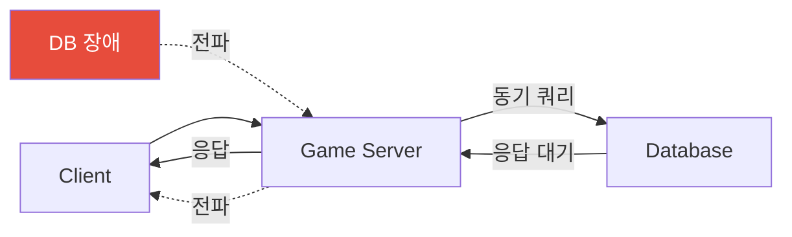
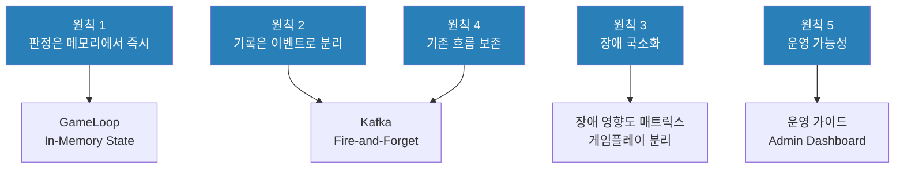
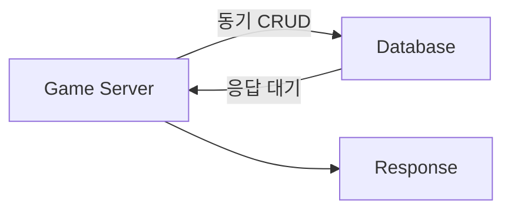

# 설계 결정 과정

[← 메인으로 돌아가기](../README.md)

---

## 📋 목차

1. [설계 결정 요약](#설계-결정-요약)
2. [문제 정의](#문제-정의)
3. [핵심 설계 원칙](#핵심-설계-원칙)
4. [대안 비교와 선택](#대안-비교와-선택)
5. [의도적으로 하지 않은 것들](#의도적으로-하지-않은-것들)
6. [다른 도메인에서의 적용](#다른-도메인에서의-적용)
7. [배운 교훈](#배운-교훈)

---

## 설계 결정 요약

먼저 **무엇을 결정했는가**를 확인하고, 아래에서 **왜**를 읽으세요.

| # | 결정 | 핵심 이유 | 포기한 것 |
|---|------|-----------|----------|
| 1 | 실시간 판정은 메모리, 기록은 이벤트 | 장애 격리 + 게임플레이 안정성 | 데이터 즉시 일관성 |
| 2 | Server-authoritative | 치트 방지는 구조로 해결 | 클라이언트 구현 단순성 |
| 3 | Kafka 기반 Event-driven | 기능 추가 시 기존 코드 무수정 | 구현 복잡도 |
| 4 | Modular Monolith (MSA 아님) | 초기 복잡도 최소화 | 서비스별 독립 배포 |
| 5 | Polyglot Persistence | 저장소별 강점 극대화 | 단일 DB 운영 단순함 |

---

## 문제 정의

### 많은 게임 서비스가 겪는 공통 문제

```
🚨 사용자 이벤트 증가에 따른 서버 복잡도 폭증
🚨 실시간 처리와 기록 처리의 경계 불명확
🚨 장애 발생 시 영향 범위가 예측되지 않음
🚨 특정 개발자에게 운영과 구조 이해가 집중됨
🚨 기능 추가 시 기존 로직의 안정성이 지속적으로 훼손됨
```

> **문제의 핵심은 기술 부족이 아니라 구조 부재라고 판단했습니다.**

### 기존 구조의 전형적인 실패 패턴



DB 장애가 게임플레이까지 전파되는 구조 — 이것이 해결해야 할 핵심 문제였습니다.

---

## 핵심 설계 원칙

### 5대 원칙

```
1. 실시간 판정은 반드시 메모리에서 즉시 확정한다
2. 기록과 확장은 이벤트로 분리한다
3. 장애는 전파되지 않고 국소화되어야 한다
4. 기능 추가가 기존 흐름을 깨지 않아야 한다
5. 운영자가 시스템을 "이해할 수 있어야" 한다
```

### 원칙이 구조에 어떻게 반영되었는가



---

## 대안 비교와 선택

### 대안 1: 게임 서버 직접 DB 접근



| 항목 | 직접 DB 접근 | 이벤트 기반 (선택) |
|------|-------------|-------------------|
| 구현 복잡도 | ⭐⭐ (낮음) | ⭐⭐⭐⭐ (높음) |
| 실시간 안정성 | ⭐⭐ (낮음) | ⭐⭐⭐⭐⭐ (높음) |
| 장애 격리 | ⭐ (매우 낮음) | ⭐⭐⭐⭐⭐ (높음) |
| 데이터 일관성 | ⭐⭐⭐⭐⭐ (높음) | ⭐⭐⭐ (중간) |

**결론**: 실시간 안정성과 장애 격리를 선택. 데이터 즉시 일관성은 이벤트 Idempotency로 보완.

---

### 대안 2: 모든 요청 동기 처리

동시접속자(CCU)가 늘어날수록 응답 시간이 선형 증가합니다:

| CCU | 평균 응답 시간 | 결과 |
|-----|-------------|------|
| 100명 | 50ms | ✅ 허용 가능 |
| 1,000명 | 500ms | ⚠️ 체감 지연 |
| 10,000명 | 5,000ms | ❌ 게임 불가능 |

**이벤트 기반 구조**: 판정은 즉시 (50ms 고정), 기록은 비동기 → CCU와 무관하게 안정적

---

### 대안 3: 마이크로서비스 (MSA)

**선택하지 않은 이유:**
- 초기 복잡도 과다 (Over-engineering)
- 서비스 간 통신 오버헤드
- 분산 트랜잭션 복잡도
- 운영 부담 (서비스 수 × N배)

**MSA가 실제로 필요한 조건:**
- 팀이 10개 이상이고 독립 배포가 필요할 때
- 도메인 경계가 명확하고 변경 주기가 다를 때
- DevOps 팀과 모니터링 인프라가 충분할 때

**현재 선택: Modular Monolith**

```
[ Game Server ]       [ Platform Server ]
    ├── Network           ├── Kafka Consumer
    ├── Domain            ├── API Module
    └── Event             └── Persistence
```

장점: 단순한 배포, 낮은 운영 복잡도, 필요 시 경계를 따라 분리 가능

---

### 대안 4: NoSQL Only

**선택하지 않은 이유:** 정형 데이터 처리 어려움, 트랜잭션 제약

**선택한 구조: Polyglot Persistence**

```
Redis     → 캐시 + Hot Snapshot (속도 우선, TTL 자동 관리)
MongoDB   → Cold Snapshot + 비정형 이벤트 로그 (유연한 스키마)
MySQL     → 정형 데이터 + 트랜잭션 (ACID 보장)
```

---

### 대안 5: UDP 프로토콜

UDP가 더 빠르고 패킷 손실 허용이 가능하지만:
- 구현 복잡도 증가 (재전송, 순서 보장 직접 구현)
- 포트폴리오 목적은 **아키텍처 증명**

**실무 판단:** FPS·레이싱은 UDP, 턴제·퍼즐·MOBA는 TCP로 충분.  
이 프로젝트 목표 달성에 UDP는 불필요한 복잡도입니다.

---

### Fire-and-Forget의 리스크와 완화

이벤트 기반의 장점이 곧 리스크입니다. 게임 서버가 Kafka 응답을 기다리지 않으면 **이벤트 유실이 구조적으로 가능**합니다.

| 리스크 | 발생 조건 | 완화 전략 |
|--------|-----------|-----------|
| 버퍼 오버플로우 | Kafka 장애 시간 > 버퍼 용량 | 버퍼 크기 조정 + DLQ |
| 중복 이벤트 | 재전송 시 동일 이벤트 2회 처리 | Idempotency Key (Phase 2) |
| 순서 교란 | 파티션 간 이벤트 순서 불보장 | PlayerId 기준 파티션 키 |

이 리스크들은 **Phase 2(이벤트 신뢰성)**에서 구체적으로 완화합니다.  
→ [구현 로드맵](implementation-roadmap.md#phase-2-이벤트-신뢰성)

---

## 의도적으로 하지 않은 것들

> **"할 수 있다"와 "해야 한다"는 다릅니다.**

| 비선택 | 이유 |
|--------|------|
| 게임 서버에서 DB 트랜잭션 의존 | 판정 지연 → 게임플레이 안정성 파괴 |
| 모든 처리를 실시간으로 | 기록 부하가 판정 부하와 동일 경로 → 확장 불가 |
| 초기 MSA | 운영 복잡도가 구현 복잡도를 압도하는 시점에만 유효 |
| 전투·MMO 콘텐츠 완성 | 포트폴리오의 목적은 **구조 증명**, 콘텐츠 완성이 아님 |

---

## 다른 도메인에서의 적용

이 프로젝트의 설계 원칙은 게임에만 국한되지 않습니다.

| 원칙 | 게임 서버 (본 프로젝트) | Coin Data API | Production IoT |
|------|------------------------|---------------|----------------|
| **외부 격리** | DB 장애 시 게임 진행 | 거래소 장애 시 캐시 제공 | PLC 장애 시 서비스 유지 |
| **정규화 계층** | Event → DB Schema | External API → Internal Schema | Modbus → Internal Schema |
| **계약 안정성** | 운영 API 불변 | 클라이언트 API 불변 | API 스키마 불변 |
| **비동기 처리** | Kafka Event Stream | WebSocket → Cache | Kafka Event Stream |

> **"설계 원칙은 도메인을 넘어 일반화 가능합니다"**

---

## 배운 교훈

### 기술적 교훈

**1. 복잡도는 비용이다**
- "할 수 있다"와 "해야 한다"는 다름
- 복잡한 구조는 반드시 그만한 가치를 제공해야 함

**2. 장애는 언제나 발생한다**
- 장애를 막는 것보다 격리하는 것이 현실적
- "장애 시 어떻게 되는가"가 설계의 핵심

**3. 확장은 선형적이어야 한다**
- 사용자 2배 → 비용 2배가 이상적
- 비선형 확장은 지속 불가능

### 조직 관점 교훈

**1. 문서화는 필수다** — 개인의 지식은 조직에 남지 않음

**2. 운영 가능성이 구현보다 중요하다** — 만들 수 있어도 운영할 수 없으면 의미 없음

**3. 인수인계 가능한 시스템** — 특정 개발자에게 의존하는 구조는 위험

---

[← 메인으로 돌아가기](../README.md)

**Last Updated**: 2026-03-04
