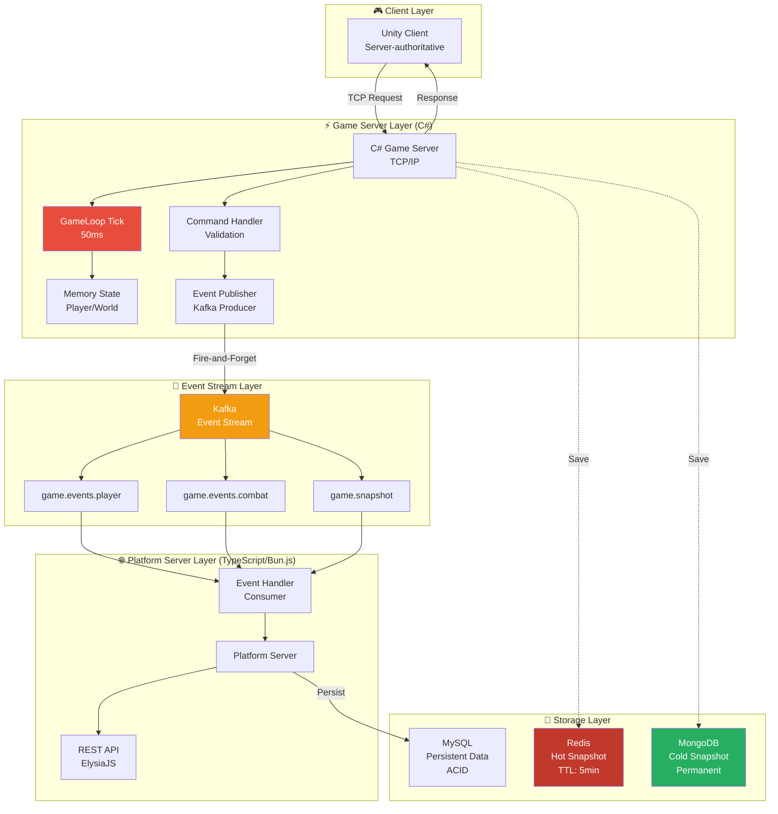
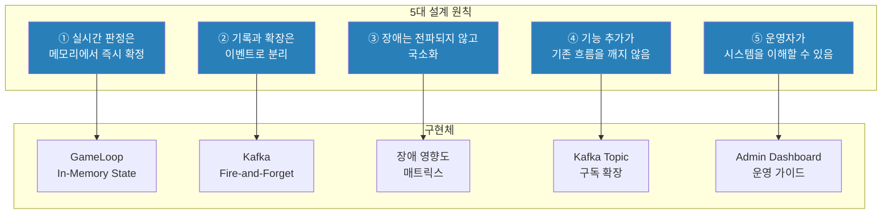
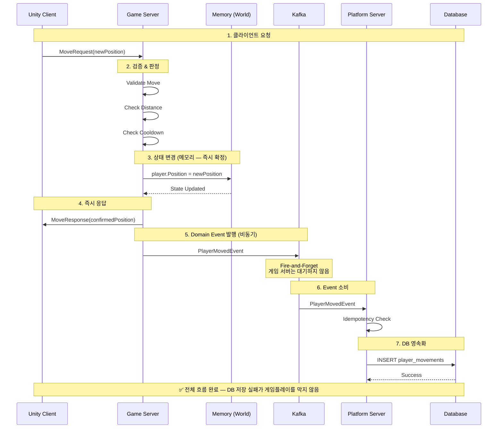
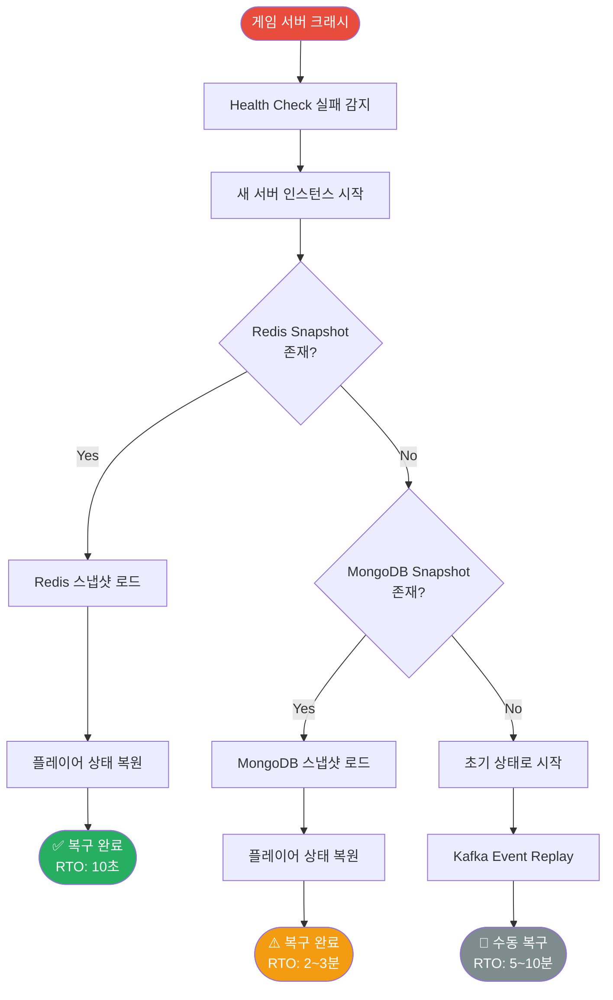
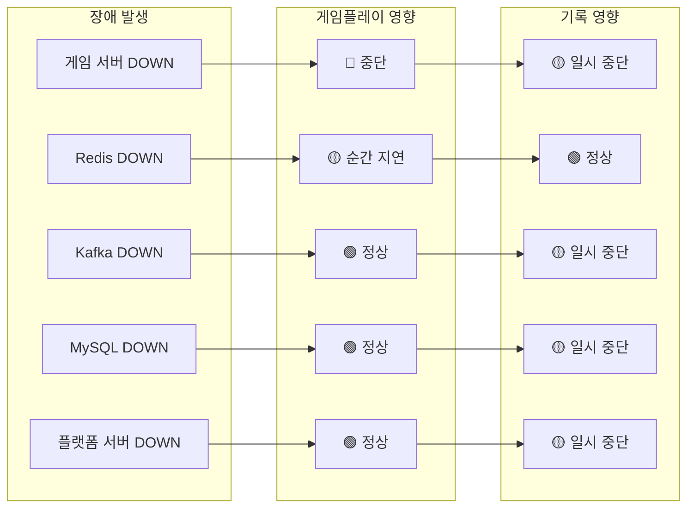
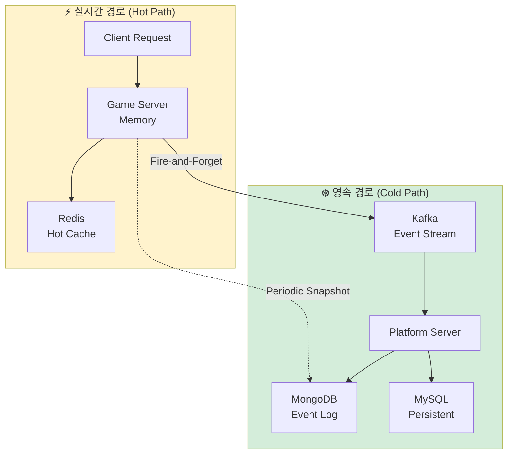
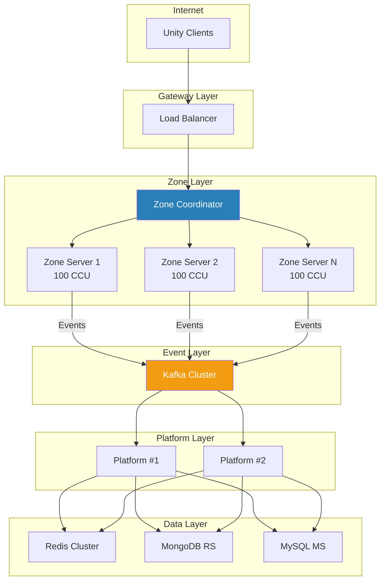
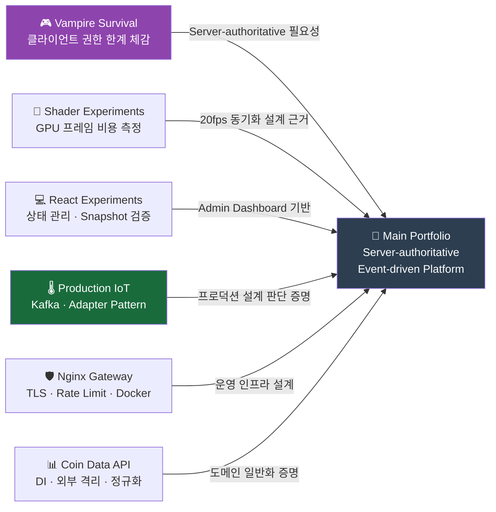

# 시스템 아키텍처 다이어그램

[← 메인으로 돌아가기](../README.md)

---

## 📋 다이어그램 사용 가이드

| 다이어그램 | 권장 사용 상황 |
|-----------|--------------|
| 전체 시스템 아키텍처 | README 첫인상, 초기 설명 |
| Command/Event 처리 흐름 | 면접·프레젠테이션에서 핵심 설계 설명 |
| 장애 복구 플로우 | 운영 관점 질문 대응 |
| 장애 영향도 맵 | "안정성을 어떻게 보장하나요?" 대응 |
| 데이터 흐름 | 기술 문서·아키텍처 리뷰 |
| 배포 아키텍처 | "확장성은?" 질문 대응 |
| 5대 설계 원칙 연결도 | "왜 이렇게 설계했나요?" 대응 |

---

## 📋 목차

1. [전체 시스템 아키텍처](#전체-시스템-아키텍처)
2. [5대 설계 원칙 연결도](#5대-설계-원칙-연결도)
3. [Command/Event 처리 흐름](#commandevent-처리-흐름)
4. [장애 복구 플로우](#장애-복구-플로우)
5. [장애 영향도 맵](#장애-영향도-맵)
6. [데이터 흐름](#데이터-흐름)
7. [배포 아키텍처 (Zone 기반 확장)](#배포-아키텍처-zone-기반-확장)
8. [Supporting Portfolios 연결도](#supporting-portfolios-연결도)

---

## 전체 시스템 아키텍처

---

## 5대 설계 원칙 연결도

---

## Command/Event 처리 흐름

### 패킷부터 DB까지의 완전한 여정

### 핵심 타이밍

```mermaid
gantt
    title 처리 타이밍 분석
    dateFormat X
    axisFormat %Lms

    section Client
    요청 전송    :0, 5
    응답 대기    :5, 50
    화면 갱신    :50, 60

    section Game Server
    패킷 수신    :5, 10
    검증        :10, 15
    상태 변경    :15, 20
    응답 전송    :20, 50
    Event 발행  :20, 25

    section Kafka
    Event 저장  :25, 100

    section Platform
    Event 소비  :100, 150
    DB 저장     :150, 250
```

---

## 장애 복구 플로우

---

## 장애 영향도 맵

---

## 데이터 흐름

### 실시간 경로 vs 영속 경로

---

## 배포 아키텍처 (Zone 기반 확장)

---

## Supporting Portfolios 연결도

---

[← 메인으로 돌아가기](../README.md)

**Last Updated**: 2026-03-04
