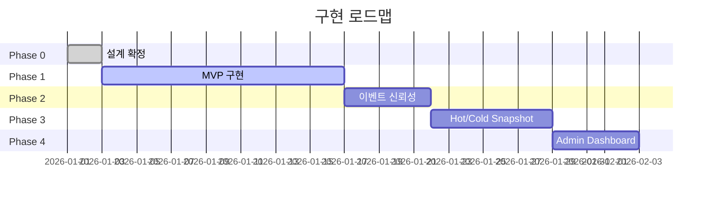
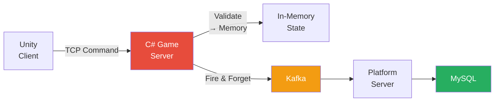
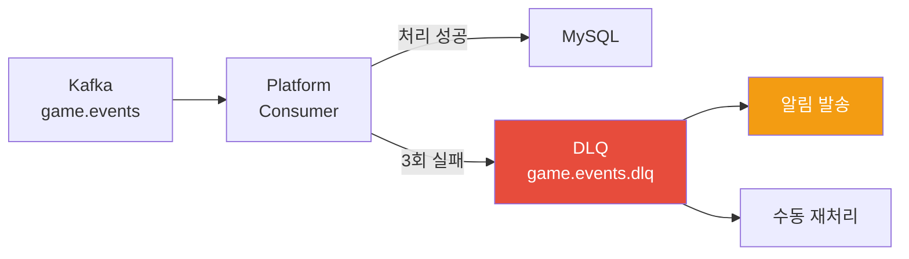
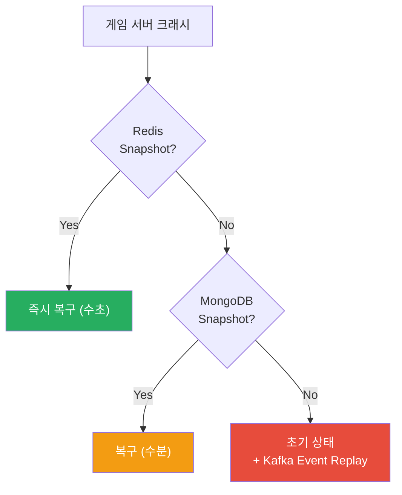

# 구현 로드맵

[← 메인으로 돌아가기](../README.md)

---

## 📋 목차

1. [전체 목표](#전체-목표)
2. [로드맵 개요](#로드맵-개요)
3. [Phase 0: 설계 확정](#phase-0-설계-확정)
4. [Phase 1: MVP 구현](#phase-1-mvp-구현)
5. [Phase 2: 이벤트 신뢰성](#phase-2-이벤트-신뢰성)
6. [Phase 3: Snapshot](#phase-3-snapshot)
7. [Phase 4: Admin Dashboard](#phase-4-admin-dashboard)

---

## 전체 목표

> **"실시간 판정은 메모리에서 끝나고, 기록과 복구는 비동기로 흡수되는 구조를 실제로 증명한다."**

이 포트폴리오는 대규모 MMO 완성을 목표로 하지 않습니다.  
**운영 가능한 실시간 시스템의 핵심 구조만을 최소 구현으로 증명**하는 것이 목적입니다.

---

## 로드맵 개요



| Phase | 내용 | 예상 소요 | 상태 |
|-------|------|-----------|------|
| Phase 0 | 설계 확정 | 1~2일 | ✅ 완료 |
| Phase 1 | MVP 구현 | 1~2주 | 🔄 진행 예정 |
| Phase 2 | 이벤트 신뢰성 | 3~5일 | 📋 계획 |
| Phase 3 | Snapshot | 4~7일 | 📋 계획 |
| Phase 4 | Admin Dashboard | 3~5일 | 📋 계획 |

**총 예상 기간**: 약 3~4주

### Phase별 완료 조건 요약

| Phase | 핵심 완료 조건 | 증명하는 것 |
|-------|---------------|------------|
| **Phase 1** | Client → Server → Kafka → Platform → DB 전체 흐름 동작 | 핵심 구조 동작 |
| **Phase 2** | 동일 이벤트 2회 전송 시 1회만 처리, DLQ로 실패 이벤트 분리 | 이벤트 신뢰성 |
| **Phase 3** | 서버 재시작 후 플레이어 상태 복원 (Redis → MongoDB 순차) | 복구 가능성 |
| **Phase 4** | 실시간 모니터링 + Snapshot 관리 UI 동작 | 운영 가능성 |

---

## Phase 0: 설계 확정

### ✅ 완료

**목적:** "이 시스템은 이렇게 만들기로 결정했다"는 기준을 고정

**확정된 설계 원칙:**
```
✓ Server-authoritative 구조
✓ Packet → Command → Domain → Event 흐름
✓ 실시간 처리와 비동기 기록의 명확한 분리
✓ 게임 서버는 DB 성공/실패를 기다리지 않는다
```

**산출물:** README.md, architecture-detail.md, design-decisions.md, operational-guide.md, diagrams.md

> 이 단계는 이후 모든 구현 판단의 기준선이 됩니다.

---

## Phase 1: MVP 구현

### 🔄 진행 예정 | 예상 소요: 1~2주

**목적:** 실시간 게임 서버와 이벤트 기반 플랫폼 서버가 실제로 분리되어 동작함을 증명



---

### 1-1. 게임 서버 (C# TCP/IP)

**구현 범위:**
```
✓ TCP/IP 소켓 서버        ✓ Session 관리
✓ Packet → Command 변환   ✓ 단일 GameLoop Tick (50ms)
✓ In-memory Player State  ✓ Domain Event 생성
✓ Kafka Producer 연동
```

**의도적으로 구현하지 않는 것:**
```
✗ 전투 시스템           ✗ MMO 콘텐츠
✗ 복잡한 동기화 로직     ✗ 클라이언트 예측(Prediction)
✗ 인벤토리 시스템
```

**체크리스트:**
```
☐ TCP 서버 기동                ☐ 클라이언트 연결 수락
☐ 패킷 수신 및 역직렬화         ☐ Command 생성
☐ GameLoop Tick 동작           ☐ Domain Event 발행
☐ Kafka 연동                   ☐ 로그 출력
```

---

### 1-2. 플랫폼 서버 (TypeScript / Bun.js)

**구현 범위:**
```
✓ Kafka Consumer 연결     ✓ 이벤트 수신 및 파싱
✓ DB 저장 (MySQL)         ✓ 간단한 API 엔드포인트
```

**핵심 포인트:**
```
✓ 플랫폼 서버는 오직 Kafka 이벤트만 소비
✓ 실시간 로직에 절대 개입하지 않음
✓ 게임 서버와 직접 통신하지 않음
```

**체크리스트:**
```
☐ Kafka Consumer 연결      ☐ 이벤트 수신 확인
☐ 이벤트 파싱              ☐ DB 저장
☐ 로그 출력                ☐ API 엔드포인트 (선택)
```

---

### 1-3. Unity 클라이언트 (증명용 테스트 클라이언트)

**구현 범위:** TCP 연결, WASD 입력 → 서버 요청 전송, 서버 응답 수신 후 위치 갱신

**시각적 기준:**
```
✓ 큐브 하나면 충분
✓ 뚝뚝 이동해도 문제 없음
✓ 부드러운 보간(Lerp)은 선택 사항
```

**체크리스트:**
```
☐ TCP 연결                 ☐ WASD 입력
☐ 패킷 전송/수신            ☐ 서버 응답 대기
☐ 위치 갱신                ☐ Debug 로그 출력
```

---

### Phase 1 완료 조건

```
☐ 게임 서버 실행
☐ Unity 클라이언트 연결
☐ WASD로 이동 요청
☐ 서버에서 검증 후 승인
☐ Kafka로 이벤트 발행
☐ 플랫폼 서버에서 이벤트 수신
☐ DB에 이동 기록 저장
☐ 1분 데모 영상 녹화
```

**이 단계까지가 MVP이며, 여기까지만으로도 포트폴리오로 충분한 설득력을 가집니다.**

---

## Phase 2: 이벤트 신뢰성

### 📋 계획 | 예상 소요: 3~5일

**목적:** Kafka 기반 구조에서 반드시 질문받는 "이벤트 신뢰성"에 대한 답을 제시

### 2-1. Idempotency (멱등성)

```csharp
// 이벤트 중복 처리 방지
public class IdempotencyService
{
    public async Task<bool> IsAlreadyProcessed(string eventId)
    {
        return await _redis.KeyExistsAsync($"processed:{eventId}");
    }

    public async Task MarkAsProcessed(string eventId)
    {
        await _redis.StringSetAsync(
            $"processed:{eventId}",
            "1",
            TimeSpan.FromDays(7)  // 7일간 중복 체크
        );
    }
}
```

### 2-2. Dead Letter Queue (DLQ)



**체크리스트:**
```
☐ Idempotency Key 설계 (eventId 기반)
☐ Redis 기반 중복 확인 구현
☐ DLQ Topic 생성 (game.events.dlq)
☐ 실패 이벤트 DLQ 라우팅
☐ 테스트: 동일 이벤트 2회 전송 → 1회만 처리 확인
```

---

## Phase 3: Snapshot

### 📋 계획 | 예상 소요: 4~7일

**목적:** 게임 서버 재시작 후 플레이어 상태가 복원됨을 실제로 증명

### 3-1. Hot Snapshot (Redis)

```csharp
public class RedisSnapshotService
{
    private const int SnapshotTtlSeconds = 300; // 5분

    public async Task SaveHotSnapshot(Zone zone)
    {
        var snapshot = JsonSerializer.Serialize(zone.Serialize());
        await _redis.StringSetAsync(
            $"snapshot:zone:{zone.Id}",
            snapshot,
            TimeSpan.FromSeconds(SnapshotTtlSeconds)
        );
    }

    public async Task<ZoneSnapshot?> LoadHotSnapshot(string zoneId)
    {
        var data = await _redis.StringGetAsync($"snapshot:zone:{zoneId}");
        return data.HasValue
            ? JsonSerializer.Deserialize<ZoneSnapshot>(data!)
            : null;
    }
}
```

### 3-2. Cold Snapshot (MongoDB)

```csharp
public class MongoSnapshotService
{
    public async Task SaveColdSnapshot(Zone zone)
    {
        var snapshot = new ZoneSnapshot
        {
            ZoneId = zone.Id,
            Timestamp = DateTime.UtcNow,
            Players = zone.Players.Select(p => p.Serialize()).ToList(),
            Checksum = CalculateChecksum(zone)
        };
        await _mongo.InsertOneAsync(snapshot);
    }
}
```

### 3-3. 복구 우선순위



**체크리스트:**
```
☐ Redis Snapshot 저장 / 로드
☐ MongoDB Snapshot 저장 / 로드
☐ 복구 우선순위 로직 구현
☐ 테스트: 게임 서버 재시작 후 플레이어 상태 복원 확인
```

---

## Phase 4: Admin Dashboard

### 📋 계획 | 예상 소요: 3~5일

**목적:** 운영 도구를 실제로 구현하여 시스템의 운영 가능성을 증명

**관련 선행 프로젝트**: [React Object State Manager](https://github.com/1985jwlee/portpolio_react) — 핵심 UI 패턴 이미 검증 완료

### 구현 예정 기능

```
1. 실시간 모니터링          2. 플레이어 상태 조회
   - Zone별 CCU               - 오브젝트 상태
   - Tick 지연 모니터링         - 상태 변경 이력

3. Event Stream 시각화      4. 장애 대응 인터페이스
   - Consumer Lag 모니터링      - Snapshot 복구 트리거
   - 이벤트 처리 속도           - 서버 재시작 컨트롤

5. Snapshot 관리
   - Hot/Cold Snapshot 목록 조회
   - 수동 Snapshot 생성
```

**체크리스트:**
```
☐ WebSocket API 구현 (실시간 메트릭 전송)
☐ React Dashboard 구현
☐ Zone별 CCU 실시간 모니터링
☐ Snapshot 관리 UI
☐ 데모 영상 녹화
```

---

## 가장 중요한 결론

> **이 로드맵의 목적은 "완성"이 아닙니다.**
>
> **"이 사람은 언제 구현을 멈추어야 하는지도 아는 엔지니어다"**
>
> 이 인상을 남기는 것이 핵심입니다.

---

[← 메인으로 돌아가기](../README.md)

**Last Updated**: 2026-03-04
